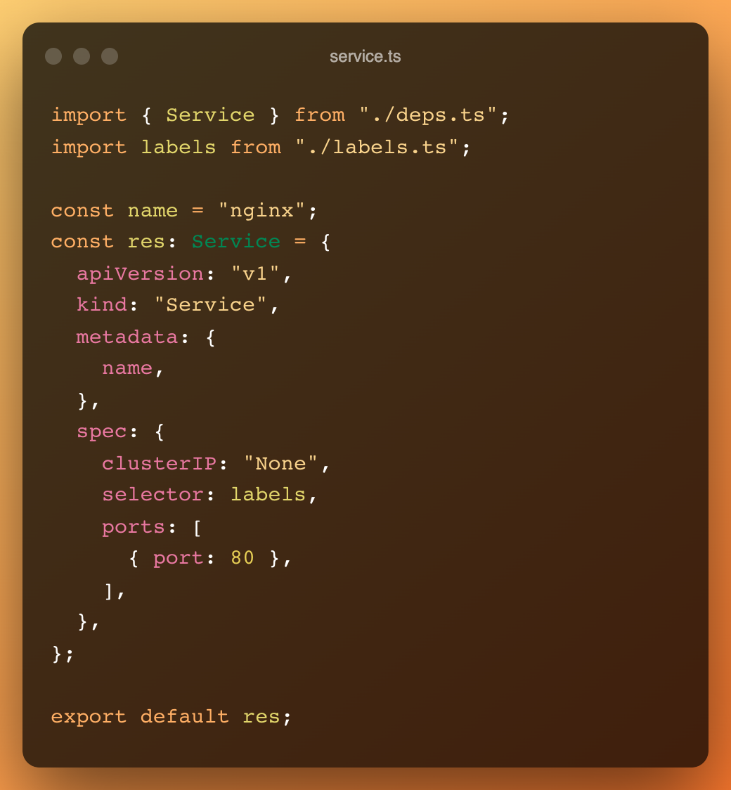

<div align="center">
<p align="center">


**`KubeScript` is a *infrastructure as code* solution to Kubernete devops**


</p>
</div>

<hr/>

### Status

**Beta**

### Features

* [No yaml files](https://noyaml.com/).
* Type safe with Typescript.
* Safe sandbox with Deno.

## Quickstart

### Prerequisites


1. Install deno by following [the official guide](https://deno.land/manual@v1.28.1/getting_started/installation).
2. Install `KubeScript` by running the following command.

   ```bash
   deno install --unstable -A --root /usr/local -n ks https://deno.land/x/kube_script@v0.1.0/main.ts
   ```
### Quick demo

You can try `KubeScript` without writing any code.
```bash
ks https://deno.land/x/kube_script/example/nginx/mod.ts
```

### Deploy Nginx

1. Checkout this project.
   ```bash
   git clone https://github.com/in-fun/KubeScript.git
   ```

1. Generate k8s yaml files.

   ```bash
   ks example/nginx
   ```
2. Show diff from current settings.

   ```bash
   env=production ks example/nginx | kubectl diff -f -
   ```
3. Apply k8s resources.

   ```bash
   env=production ks example/nginx | kubectl apply -f -
   ```


